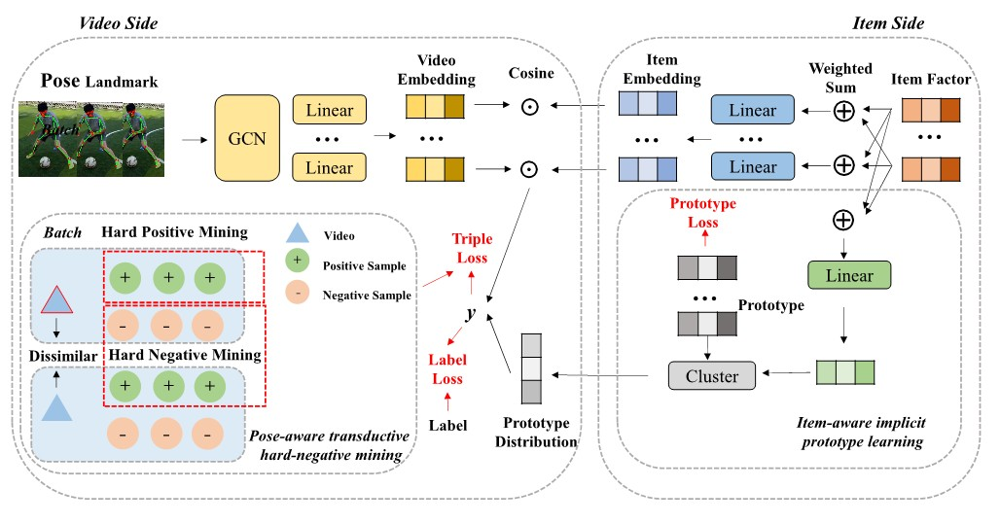

# PoseRec
Simple demo and model code of PoseRec: Human Pose Driven Object Effects Recommendation. The paper is available at https://arxiv.org/abs/2209.08353




We research the new topic of object effects recommendation in micro-video platforms, which is a challenging but important task for many practical applications such as advertisement insertion. To avoid the problem of introducing background bias caused by directly learning video content from image frames, we propose to utilize the meaningful body language hidden in 3D human pose for recommendation. To this end, in this work, a novel human pose driven object effects recommendation network termed PoseRec is introduced. PoseRec leverages the advantages of 3D human pose detection and learns information from multi-frame 3D human pose for video-item registration, resulting in high quality object effects recommendation performance. Moreover, to solve the inherent ambiguity and sparsity issues that exist in object effects recommendation, we further propose a novel item-aware implicit prototype learning module and a novel pose-aware transductive hard-negative mining module to better learn pose-item relationships. What's more, to benchmark methods for the new research topic, we build a new dataset for object effects recommendation named Pose-OBE. Extensive experiments on Pose-OBE demonstrate that our method can achieve superior performance than strong baselines. For more details, please refer to our paper at https://arxiv.org/abs/2209.08353


## USER GUIDANCE
### Demo

Command for [demo.py]: ```python demo.py --top_k 5```

The input of the demo is a pose array extracted from micro-video and many pre-defined items, the output is the top 5 recommendation list.

The pre-defined data include:
- 'sample.pkl': the pose tensor, (N, T, V, C), N: the number of the samples, T: the length of the time window, V: the number of the pose landmark (default is 33 in Blazepose), C: the number of channels (default is 4: x, y, z, and visibility) --> (5, 10, 33, 4)
- 'item_data': item name of pre-defined items --> 221
- 'item_feature.pkl': item representation of pre-defined items (num_cat, num_item, emb_size) --> (4, 221, 64)
- 'prototype_dis.npy': item prototype distribution on prototypes (num_item, num_cat) --> (221, 4)

The trained model:
- 'best_model_pose.pt': the trained pose model
  - input: pose tensor (N, C, T, V, M), M: the number of persons, default is 1. --> (5, 4, 10, 33, 1)
  - output: video (pose) representation, (num_cat, num_pose_sample, emb_size) --> (4, 5, 64)
    
### Using your video
Run [gen pose.py] to generate the demo pose array:: <br>
   ```python gen_pose.py --filename your_video_file --outname ./data/sample.pkl``` 

Then run [demo.py] as follows: ```python demo.py --pose_file ./data/sample.pkl --top_k 5```

It should be noted that the ```--outname``` must be same as ```--pose_file```

### Implementation details

Please see ```./model``` for more information on model implementation.
- ```./model/item_side.py``` Implementation of item side, item factor is transformed to item embedding
- ```./model/video_side.py``` Implementation of item side, pose array is transformed to video embedding
- ```./model/hard_neg_mining.py``` Implementation of the loss function, including norm loss, label loss, and triple loss
